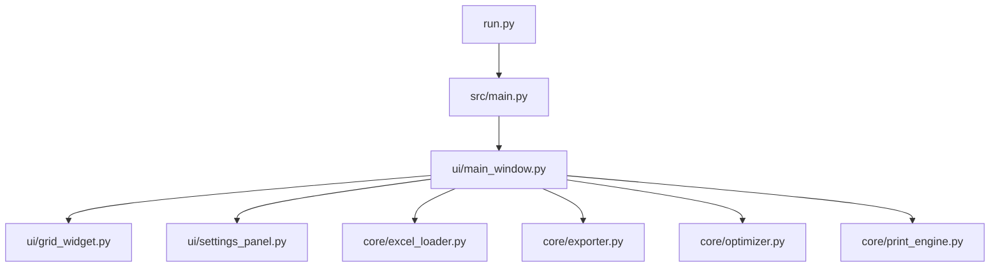

# Beautiful Excel 프로젝트 분석 문서

> **분석일**: 2024-12-04  
> **분석자**: Antigravity AI

## 1. 프로젝트 개요

### 1.1 목적
폐쇄망 환경에서 엑셀 파일을 **A4/A3 용지 규격에 맞춰 자동으로 정리 및 최적화**하여 출력하는 데스크탑 프로그램

### 1.2 배경
- 외부 인터넷 접속 불가능한 폐쇄망 환경에서 MSP(Managed Service Provider) 업무 수행
- 사용자 요청 엑셀 파일에 대한 접근이 폐쇄망에서 제한됨
- 다양한 서식의 엑셀 파일을 수동으로 A4/A3 용지에 맞춰 레이아웃 정리 필요
- 다수 컬럼과 복잡한 서식으로 인한 수동 정리 과정의 비효율성 해소

### 1.3 기술 스택
| 구분 | 기술 | 용도 |
|------|------|------|
| 언어 | **Python 3.10+** | 메인 개발 언어 |
| GUI | **PySide6** | Qt 기반 데스크탑 UI |
| Excel 처리 | **openpyxl** | XLSX 파일 읽기/쓰기 |
| Excel Legacy | **xlrd** | XLS 파일 읽기 |
| 실행 환경 | **Windows OS** | 대상 운영체제 |

---

## 2. 아키텍처 분석

### 2.1 디렉토리 구조
```
beautiful-excel/
├── run.py                   # 실행 진입점
├── src/
│   ├── __init__.py          # 패키지 초기화 (v0.1.0)
│   ├── main.py              # 메인 애플리케이션 진입점
│   ├── core/                # 핵심 비즈니스 로직
│   │   ├── excel_loader.py  # 엑셀 파일 로드
│   │   ├── exporter.py      # 엑셀 파일 저장
│   │   ├── optimizer.py     # 데이터 최적화 엔진
│   │   └── print_engine.py  # 인쇄 기능
│   ├── ui/                  # 사용자 인터페이스
│   │   ├── main_window.py   # 메인 윈도우
│   │   ├── grid_widget.py   # 데이터 그리드 위젯
│   │   ├── settings_panel.py    # 인라인 설정 패널
│   │   └── settings_dialog.py   # 설정 대화상자
│   └── utils/               # 유틸리티 (현재 비어 있음)
├── tests/                   # 테스트 코드
├── resources/               # 리소스 파일
└── claudedocs/              # 개발 문서
```

### 2.2 모듈 의존성



---

## 3. 핵심 모듈 분석

### 3.1 Core 모듈

#### 3.1.1 `excel_loader.py` (242 lines)
**역할**: 엑셀 파일(XLSX/XLS)을 읽어 데이터와 서식 정보를 추출

**주요 클래스**: `ExcelLoader`

| 메서드 | 설명 |
|--------|------|
| `load_file(file_path)` | 파일 확장자에 따라 적절한 로더 호출 |
| `_load_xlsx(file_path)` | openpyxl로 XLSX 파일 로드 |
| `_load_xls(file_path)` | xlrd로 XLS 파일 로드 (레거시 지원) |
| `extract_column_data(data, col_index)` | 특정 컬럼 데이터 추출 |

**반환 데이터 구조**:
```python
{
    'data': List[List[str]],      # 2차원 데이터 배열
    'headers': List[str],          # 첫 행 헤더
    'formatting': {
        'fonts': {(row, col): {...}},       # 폰트 정보
        'colors': {(row, col): {...}},      # 색상 정보
        'column_widths': {col: width}       # 컬럼 너비
    }
}
```

---

#### 3.1.2 `optimizer.py` (630 lines)
**역할**: 용지 규격에 맞춰 데이터를 최적화하는 핵심 엔진

**주요 클래스**: `ExcelOptimizer`

**설정 상수**:
```python
PAPER_SIZES = {
    'A4': {'landscape': {'width': 297, 'height': 210}, 'portrait': {...}},
    'A3': {'landscape': {'width': 420, 'height': 297}, 'portrait': {...}}
}
DEFAULT_MARGINS = {'top': 10, 'bottom': 10, 'left': 10, 'right': 10}  # mm
```

**최적화 기능**:

| 기능 | 메서드 | 설명 |
|------|--------|------|
| 폰트 최적화 | `_optimize_font()` | 전체 셀에 지정 폰트 크기 일괄 적용 |
| 빈 셀 최적화 | `_optimize_empty_cells()` | 빈 셀 50%+ 컬럼의 헤더 축소 및 너비 감소 |
| Bold 최적화 | `_optimize_bold_text()` | 컬럼별 공통 접두사 2글자 이상 Bold 처리 |
| 헤더 줄바꿈 | `_optimize_header_wrap()` | 헤더가 데이터보다 1.5배 긴 경우 텍스트 래핑 |
| 레이아웃 최적화 | `_optimize_layout()` | 용지 규격 맞춤 컬럼/행 크기 조정 |

**유틸리티 메서드**:
- `_calculate_empty_ratio()`: 빈 셀 비율 계산
- `_get_column_max_length()`: 컬럼 최대 문자 길이
- `_find_common_prefix()`: 문자열 리스트의 공통 접두사
- `_calculate_page_breaks()`: 페이지 분할 지점 계산

---

#### 3.1.3 `exporter.py` (263 lines)
**역할**: 그리드 데이터를 엑셀 파일(XLSX)로 저장

**주요 클래스**: `ExcelExporter`

| 메서드 | 설명 |
|--------|------|
| `save_to_excel()` | 기본 저장 기능 (헤더 스타일링 포함) |
| `save_with_optimization()` | 최적화 정보 적용 저장 (확장 예정) |
| `_apply_formatting()` | 폰트/색상/너비 서식 적용 |
| `_auto_adjust_column_widths()` | 데이터 기반 컬럼 너비 자동 조정 |
| `_apply_print_settings()` | 인쇄 설정 (용지 크기, 방향, 여백) |

**헤더 스타일**:
- 폰트: `맑은 고딕`, Bold
- 정렬: 가운데 정렬, 텍스트 래핑
- 배경색: `#D9E1F2` (연한 파랑)

---

#### 3.1.4 `print_engine.py` (247 lines)
**역할**: QPrinter를 사용한 인쇄 및 미리보기 기능

**주요 클래스**: `PrintEngine`

| 메서드 | 설명 |
|--------|------|
| `print_preview()` | QPrintPreviewDialog로 미리보기 표시 |
| `print_document()` | QPrintDialog로 인쇄 실행 |
| `_create_printer()` | 용지 설정이 적용된 QPrinter 생성 |
| `_render_page()` | QPainter로 페이지 렌더링 |

**페이지 렌더링 특징**:
- 헤더를 모든 페이지 상단에 반복 출력
- 폰트: `맑은 고딕`
- 자동 페이지 분할 처리

---

### 3.2 UI 모듈

#### 3.2.1 `main_window.py` (551 lines)
**역할**: 메인 윈도우 및 전체 UI 조율

**주요 클래스**: `MainWindow` (QMainWindow 상속)

**메뉴 구조**:
```
파일(F)
├── 열기(O)          Ctrl+O
├── 저장(S)          Ctrl+S
├── 다른 이름으로 저장(A)  Ctrl+Shift+S
└── 종료(X)          Ctrl+Q

편집(E)
├── 붙여넣기(V)       Ctrl+V
└── 모두 지우기(C)

인쇄(P)
├── 인쇄 미리보기(V)  Ctrl+Shift+P
└── 인쇄(P)          Ctrl+P

도움말(H)
└── 프로그램 정보(A)
```

**핵심 기능**:
- 파일 로드/저장 (XLSX/XLS)
- 클립보드 붙여넣기 (엑셀 복사 데이터)
- 설정 적용 (용지, 방향, 폰트 크기)
- 최적화 실행 (F5 단축키)
- 인쇄 기능 연동

---

#### 3.2.2 `grid_widget.py` (384 lines)
**역할**: 엑셀 데이터 표시 및 편집 그리드

**주요 클래스**: `GridWidget` (QTableWidget 상속)

**기본 설정**:
- 초기 크기: 20행 × 10열
- 기본 폰트: `맑은 고딕`, 10pt
- 편집: 더블클릭 또는 키입력으로 활성화

**주요 기능**:
| 메서드 | 설명 |
|--------|------|
| `set_data()` | 데이터와 헤더 설정, 컬럼 자동 조정 |
| `get_data()` / `get_headers()` | 현재 데이터 추출 |
| `paste_from_clipboard()` | Ctrl+V로 탭/줄바꿈 구분 데이터 붙여넣기 |
| `apply_optimization()` | 최적화 결과 적용 (폰트, Bold, 너비 등) |
| `apply_font_size()` | 전체 셀 폰트 크기 변경 |
| `set_cell_bold()` | 특정 셀 Bold 처리 |

---

#### 3.2.3 `settings_panel.py` (148 lines)
**역할**: 그리드 상단에 배치되는 인라인 설정 컨트롤

**시그널**:
- `settings_changed(dict)`: 설정 변경 시 발생
- `optimization_requested()`: 최적화 버튼 클릭 시 발생

**설정 항목**:
| 항목 | 위젯 | 옵션 |
|------|------|------|
| 용지 크기 | QRadioButton | A4 (기본), A3 |
| 용지 방향 | QRadioButton | 가로 (기본), 세로 |
| 글자 크기 | QSpinBox | 8~14pt (기본: 10pt) |

---

#### 3.2.4 `settings_dialog.py` (146 lines)
**역할**: 설정 대화상자 (모달)

> `settings_panel.py`와 유사한 기능이지만 대화상자 형태로 제공. 현재 `MainWindow`에서는 `SettingsPanel`만 사용 중.

---

## 4. 기능 요구사항 충족도

| 요구사항 | 구현 상태 | 관련 파일 |
|----------|-----------|-----------|
| 엑셀 파일 불러오기 (XLSX/XLS) | ✅ 완료 | `excel_loader.py` |
| 클립보드 붙여넣기 | ✅ 완료 | `grid_widget.py`, `main_window.py` |
| 엑셀 파일 저장 | ✅ 완료 | `exporter.py` |
| 용지 선택 (A4/A3) | ✅ 완료 | `settings_panel.py` |
| 방향 선택 (가로/세로) | ✅ 완료 | `settings_panel.py` |
| 글자 크기 조절 | ✅ 완료 | `settings_panel.py` |
| 폰트/크기 일괄 변환 | ✅ 완료 | `optimizer.py` |
| 빈 셀 최적화 | ✅ 완료 | `optimizer.py` |
| 컬럼별 공통 텍스트 Bold | ✅ 완료 | `optimizer.py` |
| 헤더 자동 줄바꿈 | ✅ 완료 | `optimizer.py` |
| 인쇄/미리보기 | ✅ 완료 | `print_engine.py` |

---

## 5. 코드 품질 분석

### 5.1 긍정적 측면

1. **명확한 모듈 분리**: Core와 UI의 책임이 잘 분리됨
2. **일관된 한글 문서화**: 모든 함수에 한글 docstring 작성
3. **타입 힌트 사용**: `typing` 모듈을 활용한 명시적 타입 표기
4. **예외 처리**: 파일 I/O 및 사용자 피드백에 적절한 예외 처리
5. **표준 디자인 패턴**: Qt 시그널/슬롯 패턴 활용

### 5.2 개선 가능 영역

1. **`utils/` 미활용**: 유틸리티 디렉토리가 비어 있음
2. **설정 중복**: `SettingsPanel`과 `SettingsDialog`의 코드 중복
3. **하드코딩된 값**: 폰트명 `맑은 고딕`이 여러 곳에 반복
4. **부분 Bold 미지원**: `_set_cell_partial_bold()`가 전체 Bold로 대체됨
5. **로깅 부재**: Python logging 모듈 미사용

---

## 6. 코드 통계

| 파일 | 라인 수 | 설명 |
|------|---------|------|
| `optimizer.py` | 630 | 최적화 엔진 (최대) |
| `main_window.py` | 551 | 메인 윈도우 |
| `grid_widget.py` | 384 | 그리드 위젯 |
| `exporter.py` | 263 | 엑셀 저장 |
| `print_engine.py` | 247 | 인쇄 엔진 |
| `excel_loader.py` | 242 | 엑셀 로드 |
| `settings_panel.py` | 148 | 설정 패널 |
| `settings_dialog.py` | 146 | 설정 대화상자 |
| `main.py` | 30 | 진입점 |
| **총계** | **~2,641** | |

---

## 7. 개발 현황

| Phase | 내용 | 상태 |
|-------|------|------|
| Phase 1 | 프로젝트 초기 설정 | ✅ 완료 |
| Phase 2 | GUI 기본 구조 | ✅ 완료 |
| Phase 3 | 데이터 입출력 | ✅ 완료 |
| Phase 4 | 핵심 최적화 로직 | ✅ 완료 |
| Phase 5 | 용지 규격 맞춤 | ✅ 완료 |
| Phase 6 | 출력/미리보기 | ✅ 완료 |
| Phase 7 | 테스트/안정화 | 🔄 진행 예정 |
| Phase 8 | 배포 준비 | 🔄 진행 예정 |

---

## 8. 결론 및 권장사항

### 8.1 현재 상태
프로젝트는 핵심 기능이 모두 구현되어 **MVP(Minimum Viable Product) 완성 단계**에 있습니다. 용지 최적화, 인쇄 기능, 파일 I/O 등 요구사항의 모든 항목이 충족되었습니다.

### 8.2 다음 단계 권장사항

1. **테스트 강화**
   - 단위 테스트 커버리지 확대
   - 다양한 엑셀 파일 형식에 대한 통합 테스트

2. **코드 리팩토링**
   - 공통 상수를 `config.py`로 분리
   - `SettingsPanel`과 `SettingsDialog` 통합 또는 상속 구조화

3. **사용자 경험 개선**
   - 최적화 진행 상태 표시 (Progress Bar)
   - 최근 파일 목록 기능

4. **배포 준비**
   - PyInstaller를 통한 Windows 실행 파일 빌드
   - 아이콘 및 리소스 번들링

---

*분석 문서 작성 완료*
